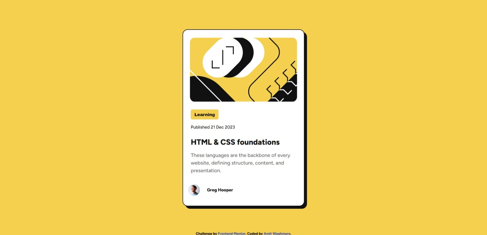

# Frontend Mentor - Blog preview card solution

This is a solution to the [Blog preview card challenge on Frontend Mentor](https://www.frontendmentor.io/challenges/blog-preview-card-ckPaj01IcS). Frontend Mentor challenges help you improve your coding skills by building realistic projects. 

## Table of contents

- [Overview](#overview)
  - [The challenge](#the-challenge)
  - [Screenshot](#screenshot)
  - [Links](#links)
- [My process](#my-process)
  - [Built with](#built-with)
  - [What I learned](#what-i-learned)
  - [Continued development](#continued-development)
- [Author](#author)

## Overview

### The challenge

Users should be able to:

- See hover and focus states for all interactive elements on the page

### Screenshot

#### Desktop-view:

#### Mobile-view:

These are the screenshots of desktop and mobile view respectively.

### Links

- Solution URL: [Click here to view the solution!](https://www.frontendmentor.io/solutions/responsive-blog-preivew-card-using-css-flexbox-b5_CAF3Sir)
- Live Site URL: [Click here to view the Live site!](https://blog-preview-card-coral-phi.vercel.app/)

## My process

### Built with

- Semantic HTML5 markup
- CSS custom properties
- Flexbox

### What I learned

While working on this project, I polished my old learnings like how to use "the hover" (I was able to use it without seeking for any help from the internet or even my previous projects) and also was easily able to make the page responsive. Though I did not learn anything new, but I am glad this project helped in polishing the old learnings. 

### Continued development

I am still facing some problems with making the page responsive, this could be because of the lack of knowledge I have about the topic. I would learn more on it and make the webpages responsive at more breakpoints.

## Author

- Github - [Amit Waghmare](https://github.com/waghmare-amit)
- Frontend Mentor - [@waghmare-amit](https://www.frontendmentor.io/profile/waghmare-amit)
- Twitter - [@waghmareamit24](https://www.twitter.com/waghmareamit24)